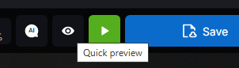
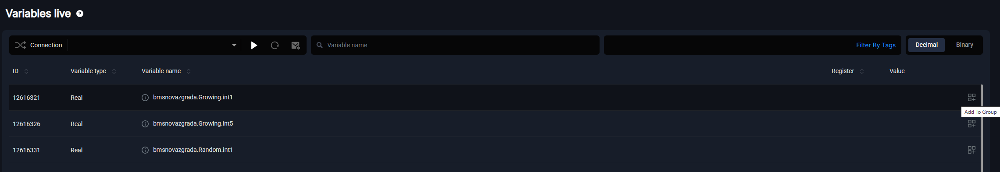
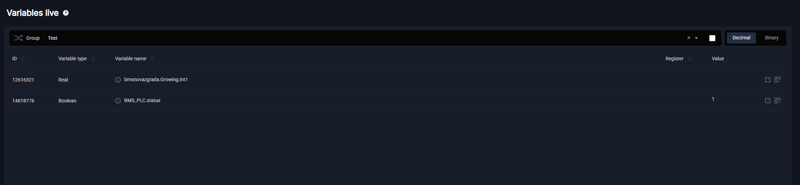
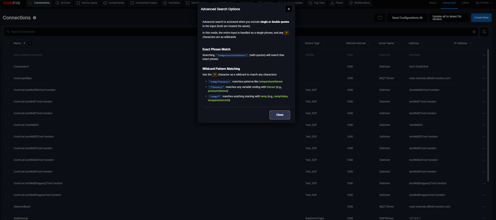

# Brzi rad aplikativca

 

**Četiri nove funkcionalnosti koje ubrzavaju svakodnevni rad u Konfiguratoru.**

 

Uvodni tekst koji opisuje kontekst.

---

### WYSIWYG

 

 

Klikom na dugme **Quick Preview** (oko ikona) u toolbaru Editora, korisnik dobija prikaz iscrtanog ekrana onakav kakav će izgledati u runtime-u — direktno unutar istog prozora, bez čuvanja konfiguracije i bez prethodnog logina. Nema rizika od gubitka rada: previewer ne menja konfiguraciju, samo je prikazuje.

---

### Follow Live Values

 

Na stranici Live Values korisnik može kreirati sopstvene grupe i u njih dodavati varijable sa različitih konekcija. Kreirane grupe potom se mogu birati kao filter — isto kao što se inače biraju konekcije — i pratiti live vrednosti svih varijabli na jednom mestu, bez skakanja po različitim stranicama.

 

---

### Advanced Search

 

 

Advanced Search omogućava korisnicima korišćenje wildcard karaktera i naprednih opcija pretrage. Aktivira se automatski kada se u polje za pretragu unesu jednostruki ili dvostruki navodnici — oba se tretiraju jednako.

U ovom režimu ceo unos se tretira kao jedna fraza, a karakter `*` funkcioniše kao wildcard.

**Pretraga tačne fraze**
Pretraga `"temperatureSensor"` (sa navodnicima) pronalazi isključivo tu tačnu frazu.

**Wildcard pretraga**
Karakter `*` zamenjuje bilo koji niz karaktera:
- `"temp*Sensor"` — pronalazi npr. `temperatureSensor`
- `"*Sensor"` — pronalazi sve varijable koje završavaju sa `Sensor` (npr. `pressureSensor`)
- `"temp*"` — pronalazi sve što počinje sa `temp` (npr. `tempValue`, `temperatureLimit`)

---

### Auto Script Renaming

 

 

Opis funkcionalnosti.
