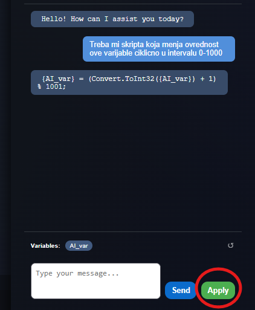
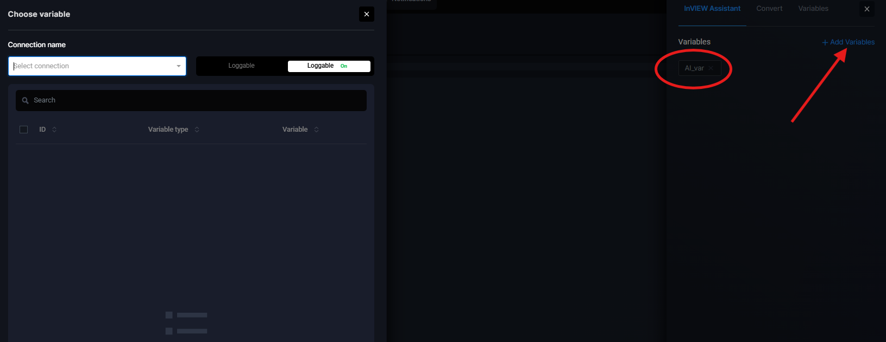

# ChatBot Scripts — AI Chat za Pisanje Skripti
 

 
**Opišite šta vaša skripta treba da radi - AI će je napisati umesto vas.**
 
Pisanje C# skripti u inView Konfiguratoru uvek je zahtevalo programersko znanje. Korisnici bez tehničkog iskustva nisu mogli kreirati automatizacije samostalno, što je opterećivalo support timove i usporavalo time-to-value. Predstavljamo ChatBot Scripts **Coding Agenta**.
 
ChatBot Scripts donosi AI chat asistenta direktno u Konfigurator - opisujete željenu logiku prirodnim jezikom, a chatbot generiše spreman C# kod koji možete primeniti jednim klikom. Skripte više nisu privilegija programera.
 
- Coding Agenta dostupan direktno u Scriptingu u Konfiguratoru, bez napuštanja konteksta
- Generisani kod se primenjuje u Scripting editor jednim klikom (APPLY)
- Varijable iz konfiguratora mogu se uključiti u kontekst

---

### Kako funkcioniše?

**Tri koraka od opisa do gotove skripte.**
 
**Open Chat (Read/Generate):** Dugme u Scripts ekranu otvara AI chat panel. Korisnik opisuje željenu automatizaciju, chatbot generiše C# snippet kompatibilan sa sintaksom platforme. 

 
**APPLY (Write/Sync):** Klikom na APPLY dugme, generisani kod se sinhronizuje direktno u Scripting editor. Podržane su iteracije - korisnik može tražiti izmene u chatu sve dok kod ne bude ispravan.

 
**Varijable (Context-Aware):** Varijable iz konfiguratora mogu se uključiti u chat prozor. Model tada generiše kod isključivo koristeći dostupne sistemske varijable, eliminirajući greške zbog nepostojećih referenci.

