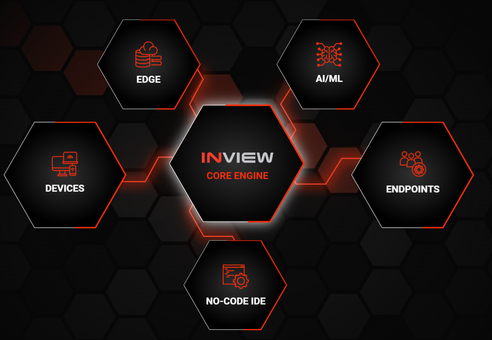
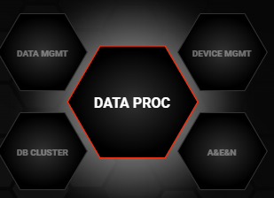
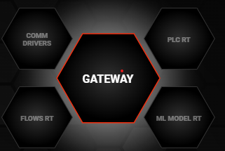
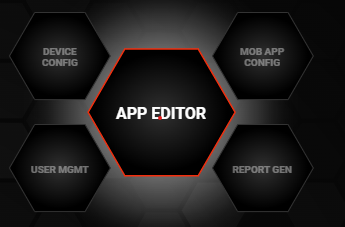
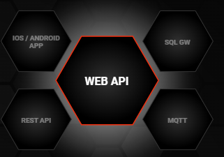
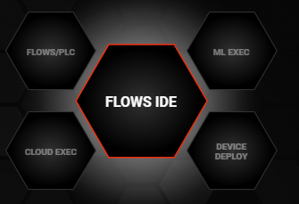
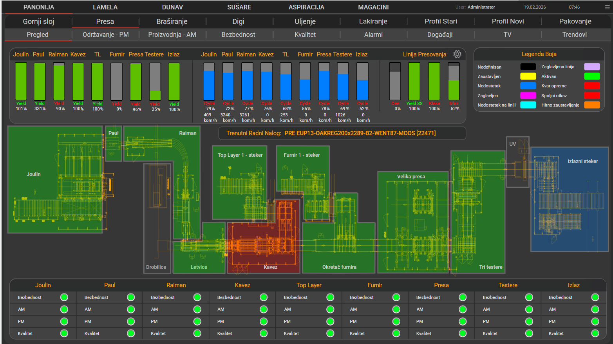
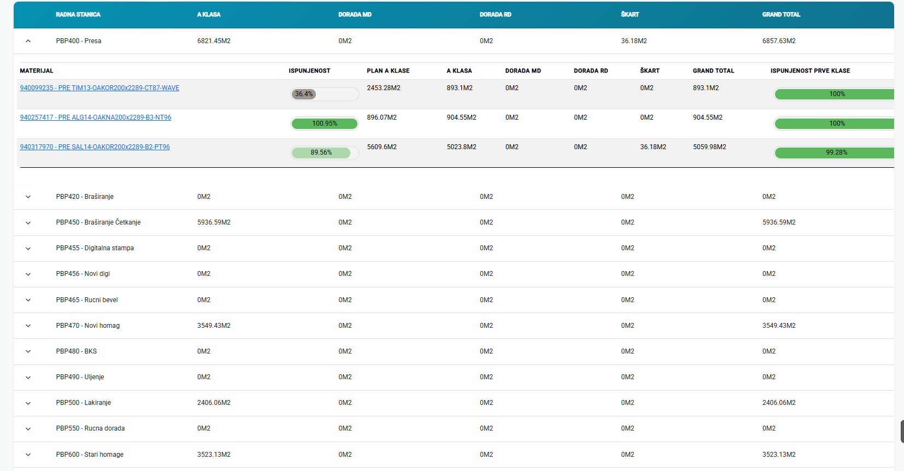
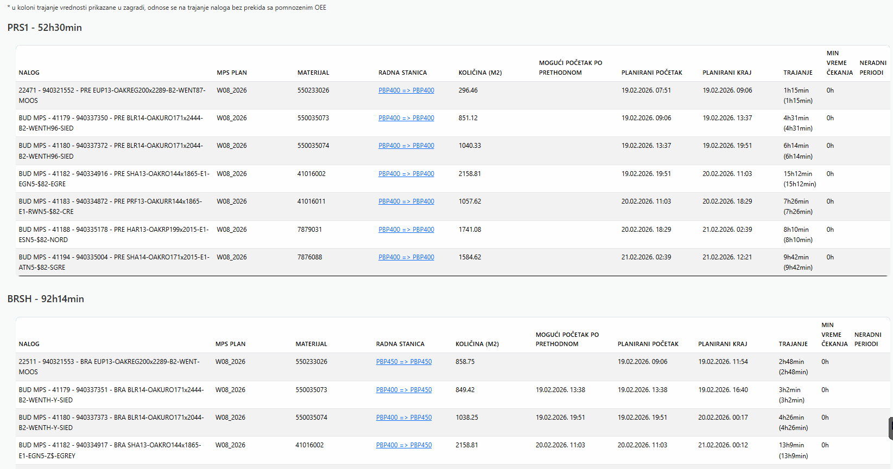
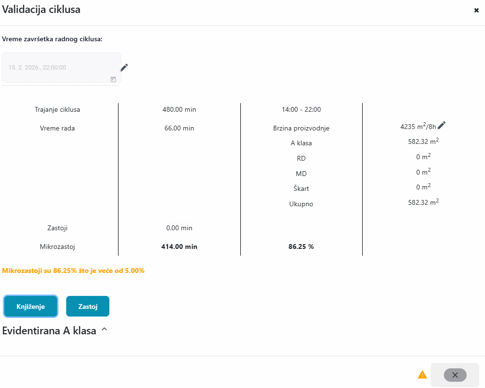

<!-- slide: 1/27 — Title -->

# InView - Cloud SCADA
## INIT Technologies

---

<!-- slide: 2/27 — Who We Are -->

## Who We Are

**INDAS Group / INIT Technologies — Novi Sad, Serbia**

- INDAS Group founded **1992** — 30+ years in industrial software
- INIT Technologies spun off **2020** — focused on software product R&D
- **inVIEW** first commercial release: **2011**, microservices + cloud-native since 2017
- Full-stack capability: field protocols → edge → cloud → AI/ML → web/mobile
- In-house R&D — no outsourcing, continuous development

<!-- talk:
- Don't oversell. Just state the facts — 30 years, real deployments, in-house team
- If they ask about stack, you can go deeper — this is the opening slide
- Key message: mature product, active development, not a startup
-->
---

## Introducing inVIEW

**Cloud-driven. Edge automation. AI-enhanced.**

inVIEW is an **Industrial Cloud SCADA** that connects your machines, devices, databases and software — and lets you build real-time dashboards, SCADA visualizations, and MES workflows.

**Three core promises:**
1. **See everything** — real-time data from every device, anywhere
2. **Control everything** — remote commands, automation, alarms
3. **Understand everything** — AI/ML that finds patterns you can't see manually

> *"It's not just monitoring. It's an evolution of how you run your production."*

---

<!-- slide: 5/27 — The Platform: 6 Modules -->

## The Platform — 6 Modules

<!-- talk:
- Use this as a map — "we'll walk through each of these in order"
- Key message: full stack, not a point solution
- The order follows the data flow: processing → connectivity → configuration → integration → intelligence → edge
-->

---

<!-- slide: 6/27 — CORE ENGINE -->

## CORE ENGINE — Real-Time SCADA at the Center

**The heart of the platform. Proven to scale solutoin**

- Real world data inside the Platform - live variable streaming
- **Remote control** of field devices — write commands from anywhere in the world
- **Alarm management** — configurable thresholds, deadband, double-check validation, false alarm prevention
- Multi-source data aggregation — heterogeneous devices, one unified view
- Multi-channel notifications: SMS, Email, Push

#Proven to Scale
- **100,000 simultaneous screen views** — live, on microservices architecture
- Multi-tenant: multiple enterprise customers on shared infrastructure
- Kubernetes orchestration — horizontal scaling, zero-downtime deployments

---

<!-- slide: 7/27 — DEVICES + Gateways -->

## DEVICES — Connect Anything

**We speak the language of your machines.**

*Natively supported protocols:*
- **Siemens S7** — direct PLC connection
- **OPC UA / OPC DA** — industrial interoperability standard
- **Modbus TCP** — most common industrial protocol
- **IEC 60870-5-104** — power grid, utilities, telecontrol
- **MQTT / LoRaWAN** — modern IoT sensors
- **i3x** — inVIEW proprietary protocol for gateway communication

*inVIEW IoT Gateways — for everything else:*
- Hardware gateways that bridge legacy equipment to the platform
- Support: **Modbus RTU/TCP, Siemens S7, Ethernet/IP, Profinet, OPC**
- **Custom script execution on the gateway** — JavaScript logic runs locally, at the source
- **Store & Forward** — buffers data locally during connectivity loss, syncs automatically
- Gateway software is open for custom driver development

> *"If your machine generates data, we can connect to it — and process it right where it lives."*

<!-- talk:
- Ask them upfront: "What PLCs and protocols are you running?" — Siemens is very likely for Parador (German manufacturer)
- The gateway story is important: for older machines that don't speak modern protocols
- Custom scripts on gateway = edge intelligence without cloud dependency
- Store & Forward kills the "what happens if internet goes down" objection immediately
- "We don't replace your automation hardware — we add an intelligence layer on top"
-->

---

<!-- slide: 8/27 — NO-CODE IDE -->

## NO-CODE IDE — Your Team Builds It

**The people who know your process — build the application.**

- **Drag-and-drop screen builder** — no programming required
- Configurator runs entirely in a browser — no software to install
- Your technician builds a new screen, not your software developer

**One tool — web and mobile:**
- Screens built in the IDE render on **web browser** and in the **native mobile app** (iOS & Android)
- No separate mobile development — same screen definition, same data, same configuration

**What this means in practice:**
- Not dependent on a vendor for every configuration change
- IT team or production engineers own the setup
- **Templates** — configure one machine, replicate to 50 identical ones instantly
- New production line → new screen in days, not months

> *"Most SCADA vendors charge you every time you want to change a label. Your team does it themselves — and it works on every device."*

<!-- talk:
- Strong reaction slide for people who've dealt with rigid SCADA vendors
- Be honest: Configurator v3 is in active development — current version works, new one is coming
- Template story is very practical: "50 identical presses, configure once, deploy 50 times"
- "No-code doesn't mean limited — it means the domain expert, not the developer, is in control"
-->

---

<!-- slide: 9/27 — ENDPOINTS -->

## ENDPOINTS — Connect to Everything Outside

**inVIEW doesn't live in isolation. It talks to your entire ecosystem.**

**InView visualisation tools**
- **Web Client** — expose live and historical tag data via standard InView Client — any browser, app
- **Mobile App** — native iOS & Android app — same screens built in the No-Code IDE, always in sync, works on the shop floor
- **Power BI** — connect inVIEW as a data source for business-level reporting, KPI dashboards, and management overviews
- **Grafana** — plug inVIEW into Grafana for open-source analytical dashboards and time-series visualization
**External systems to integrate with via**
- **REST API** — standard HTTP endpoints for any external system
- **MQTT broker** — publish data to any MQTT subscriber
- **Webhooks / Event Hooks** — trigger external actions on alarms or data events

> *"Any system that can send or receive HTTP, WebSocket, or MQTT can integrate with inVIEW."*

<!-- talk:
- This is the integration layer — relevant when they ask "how does it connect to our ERP/SAP/MES?"
- Value2REST is a practical example: every time a tag changes, automatically POST to SAP
- Webhooks are useful for triggering external workflows from inVIEW alarm events
- If they have an existing historian or database — "we can read from it directly"
-->

---

<!-- slide: 10/27 — AI/ML -->

## AI / ML — Your System Gets Smarter Over Time

**Built in. Not bolted on.**

What the AI layer does:

- **Anomaly Detection** — Z-Score, IQR, Rate-of-Change, Timeout — ensemble detection for accuracy
- **Self-Prediction** — LSTM neural networks + Random Forest for time-series forecasting
- **Feature Selection** — Pearson, Spearman, Mutual Information — finds which variables actually matter
- **Model Versioning** — incremental model updates, no full retraining needed
- **MLflow integration** — professional ML lifecycle management

> *"Your press temperature starts drifting at 02:00 AM. By 06:00 AM it would have caused a quality defect. The system flags it at 02:15 AM. Your night shift fixes it before morning. That's pattern recognition on your own historical data."*

<!-- talk:
- Don't oversell "AI" — be specific: anomaly detection and prediction, not general intelligence
- The ensemble approach (multiple algorithms running in parallel) is worth mentioning — higher accuracy, fewer false positives
- "The more historical data you have, the better it gets" — Tarkett has years of data now
- MLflow mention is good for technical audiences — shows mature ML lifecycle thinking
- Key: it's native to the architecture, not a third-party add-on
-->

---

<!-- slide: 11/27 — EDGE -->

## EDGE — Intelligence Where the Data Is Born

**Processing logic runs directly on the edge device — at the machine, at the site.**

**What edge computing means here:**
- Automation scripts run **locally** — no cloud round-trip for time-sensitive decisions
- Works fully **offline** — no internet connection required for local operations
- Reduces bandwidth — only relevant, processed data goes upstream
- Latency-sensitive control stays on-site

**Edge + Gateway combination:**
- inVIEW Gateway runs edge scripts at the protocol bridge level
- Custom JavaScript logic executes at the source
- Local alarm detection, filtering, and aggregation before cloud sync
- Scales to hundreds of distributed edge nodes from one central management interface

> *"You have a press line with poor connectivity. With Edge, that line is fully autonomous — it monitors, reacts, logs — with or without a live cloud connection."*

<!-- talk:
- This is the most technically interesting module for many industrial customers
- The "offline capable" point is critical for factories with unreliable connectivity
- Tie back to gateways from the DEVICES slide — "the gateway IS the edge node"
- Mention store & forward again as the data reliability mechanism
- "Managing 100 edge nodes from one central interface" — that's the scale story for distributed facilities
-->

---

<!-- slide: 12/27 — Deployment -->

## Deployment — Your Rules, Your Infrastructure

**Same platform. Same features. Your choice of where it runs.**

| Model | What it means |
|---|---|
| **Cloud (SaaS)** | We host and manage — you just log in|
| On-Premise | Fully on your servers, your data center, your control |
| Hybrid | Some on-site, some cloud — best of both worlds |
| Edge + Cloud | Local autonomy + cloud visibility and analytics |

**No feature tiering by deployment model.**

> *"You don't get a stripped-down version for on-premise. Same features, same platform — wherever you run it."*

<!-- talk:
- German company = likely data sovereignty concerns — address proactively
- "Your data never has to leave your building if you don't want it to"
- GDPR-aware architecture — EU company, EU-first thinking
- Hybrid is the most common real-world scenario — edge/gateway on-site, dashboards in cloud
-->

---

<!-- slide: 13/27 — Proven at Scale -->

## Proven at Scale

**Not a demo system. Production numbers.**

- **100,000 simultaneous screen views** — live, on microservices architecture
- Multi-tenant: multiple enterprise customers on shared infrastructure
- Kubernetes orchestration — horizontal scaling, zero-downtime deployments
- Apache Kafka event streaming — 17 system-wide topics, built for throughput
- Redis caching — sub-millisecond data access

**What this means for you:**
- Start with one production line. Scale to your entire facility. Same platform.
- Add MES, add AI — no platform migration needed.

> *"We built it right from the beginning. The architecture assumptions from 2017 have held up at scale we didn't fully anticipate."*

<!-- talk:
- 100k simultaneous views is a real production number — worth stating plainly
- The Kafka/Redis/K8s stack signals to technical people that this is serious engineering
- "We were surprised ourselves" is honest and credible — don't oversell it
- Key takeaway: you won't outgrow it
-->

---

<!-- slide: 14/27 — Integration -->

## Integration — We Connect to Your World

**inVIEW doesn't replace your existing systems. It integrates with them.**

- **SAP** bidirectional — production orders flow in, execution data flows back automatically
- **ERP / MES systems** — standard REST API integration with any modern platform
- **Historians and databases** — read from existing data stores
- **Pre-built connectors** — common integration scenarios ready out of the box

**The SAP story in practice:**
- SAP sends production order → visible on floor screen immediately
- Operator executes: quantities, materials, downtime all tracked
- At order close → actual data confirmed back to SAP automatically
- No manual data entry. No phone calls. SAP always reflects reality.

> *"The gap between what SAP thinks happened and what actually happened on the floor — that gap closes completely."*

<!-- talk:
- If they use SAP (very likely for Parador) — this is the slide that resonates most
- "Manual entry between SAP and the floor" is a universal frustration in manufacturing
- Bidirectional is key — not just sending data TO SAP, but receiving orders FROM SAP
- "We have this running live at Tarkett — let me show you what it looks like"
-->

---

<!-- slide: 15/27 — Fast Implementation & Support -->

## Fast Implementation & Real Support

**Two things that matter after you sign.**

**Fast implementation:**
- Projects go live in **weeks**, not years
- No-code configuration dramatically reduces setup time
- Templates from similar deployments accelerate new projects
- Local team — no outsourcing, no timezone issues

**High-level support:**
- Direct access to the people who built the system
- No tier-1 / tier-2 / ticket queues
- We know your specific installation
- Reaction time measured in hours, not days

> *"A competitor lost a deal to us once. 18 months later the customer called us — their implementation still wasn't live. We were in production in 3 weeks."*

<!-- talk:
- These two points often decide deals more than features do
- Be concrete about speed: "Our fastest was 3 weeks from kickoff to live"
- The support differentiation vs. Siemens/AVEVA is stark — emphasize it
- "You'll have a direct contact who knows your system" — personal, not transactional
-->

---

<!-- slide: 16/27 — Why inVIEW Summary -->

## Why inVIEW — The Short Version

**If you remember one thing from today:**

- ✅ **Proven** — 15+ years in real production environments, active development
- ✅ **Open** — connects to everything you already have, no rip-and-replace
- ✅ **Fast** — weeks to go live, not years
- ✅ **Configurable** — your team owns it, not the vendor
- ✅ **Complete** — SCADA + MES + AI/ML in one platform
- ✅ **Supported** — directly by the people who built it

> *"You don't need to rip anything out. You need a platform that makes your existing setup smarter."*

<!-- talk:
- This is the pivot slide — from product overview to proof
- Transition: "I want to show you exactly what this looks like in a real factory. Same industry as you."
- Keep it brief — don't re-explain everything, just land the summary and move on
-->

---

<!-- slide: 17/27 — Tarkett Intro -->

## Tarkett — Same Industry, Same Challenges

**Global flooring leader. Similar production reality to yours.**

- Tarkett Backa Palanka: **PVC, Wood, and Textile production**
- High-volume continuous manufacturing — multiple product lines running in parallel
- Complex machinery, tight quality tolerances, high cost of downtime
- **SAP** as the ERP backbone of the entire operation
- INIT partnership running since **2016** — two divisions, still expanding

> *"Flooring. Wood panels. Continuous production lines. Quality-critical. SAP-integrated."*

<!-- talk:
- The industry parallel is the whole point — say it explicitly
- "Same machines. Same pressures. Same production complexity."
- Don't rush — let the connection sink in before moving to the challenge
-->

---

<!-- slide: 18/27 — Tarkett Wood: Challenge -->

## Tarkett Wood — The Challenge

**Wood panel production. Complex. Multi-stage. SAP-connected.**

**Before inVIEW MES:**
- Production was planned in SAP — but execution on the floor was disconnected
- No real-time work order tracking — operators worked from printed sheets
- Downtime and stoppages recorded manually — hours later, sometimes not at all
- Shift reports took **45 minutes** to complete manually — every single shift
- Quality issues not traceable back to specific production parameters
- SAP always lagged reality — no one trusted the numbers

> *"Management could see what was planned. Nobody could see what actually happened."*

<!-- talk:
- These are all very recognizable problems for any production manager
- The 45-minute shift report is a concrete pain point — pause on it
- "SAP lagged reality" — this is the core integration gap we solved
- Don't rush to the solution yet. Let the problems register.
-->

---

<!-- slide: 19/27 — Tarkett Wood: What We Built -->

## Tarkett Wood — SCADA + MES (since 2021)

**A full Manufacturing Execution System built on the inVIEW SCADA foundation.**

**SCADA layer — real-time visibility:**
- Full production floor visualization — presses, brush lines, packaging, all zones live
- Real-time machine status, cycle parameters, trend analysis
- TV screens on the shop floor — always-on production overview for operators

**MES layer — planning and execution:**
- **Production planning** — visual planning board, shift scheduling, line assignments
- **Work order lifecycle** — SAP order → floor screen → execution tracked step by step
- **Cycle evidence** — every press cycle recorded: duration, parameters, outcome
- **Downtime management** — stoppages auto-detected, reason codes logged, duration tracked
- **Quality & yield** — per-order data, reject tracking, product version management
- **Shift reports** — generated automatically at shift end. Zero manual input.

<!-- talk:
- Show screenshots here if you have them — planning screen, work order view, shift report
- The cycle evidence is a good technical detail — every press cycle, not just daily totals
- Auto-detected downtime is significant: "the system knows when a machine stops, the operator just confirms why"
- "Shift report generates itself" — this always gets a reaction
-->

---

<!-- slide: 20/27 — SAP Integration -->

## SAP Integration — Data Flows Both Ways

**inVIEW and SAP talk to each other — automatically.**

**inVIEW → SAP (data flowing back to ERP):**
- Actual production quantities confirmed per order
- Material consumption reported
- Downtime events and stoppage reasons
- Work order status updated in real time
- Quality deviations flagged

**SAP → inVIEW (data flowing down to the floor):**
- Production orders pushed directly to floor screens
- Material requirements, BOMs, product versions
- Shift schedules and planning parameters

> *"SAP always reflects what actually happened on the floor. Not because someone entered data — because the system entered it automatically."*

<!-- talk:
- Bidirectional is the key word — not just monitoring, actual SAP confirmation
- "No manual data entry between floor and ERP" — this is the line that hits hardest
- Pause after the quote. Let it land.
- If they ask about SAP version compatibility — confirm specifics with team, we support standard interfaces
-->

---

<!-- slide: 21/27 — Tarkett Results -->

## Tarkett — Results

**Wood Division (MES since 2021):**
- Production planning fully digitalized and connected to SAP
- Every work order tracked from SAP creation to floor completion
- Every press cycle recorded — full production traceability
- Downtime automatically detected and categorized
- **Shift reports automated** — 45 minutes of manual work → 0
- Live quality data per order, per shift, per product version

**PVC Division** *(running since 2016 — mentioned for reference):*
- Full SCADA monitoring and control across all production zones
- OEE tracking, command system, SAP-integrated production orders

> *"They started with one line in 2016. Today they run two full divisions on inVIEW. That's 10 years of continuous expansion — the real proof isn't the sale, it's that they keep growing it."*

<!-- talk:
- The Wood results are the main story — go through them
- PVC is just a footnote here — "and by the way, we've also been running PVC since 2016"
- The 10-year partnership point is powerful — it signals reliability and trust
- "They keep asking for more features" — that's the truest signal of a successful deployment
-->

---

<!-- slide: 22/27 — Screenshot: SCADA Overview -->

## Tarkett Wood — SCADA Live View

<!-- talk:
- Live SCADA screen from the wood production floor
- Real-time machine states, temperature, speed, status — all visible at a glance
- This is what the operator sees every shift
-->

---

<!-- slide: 23/27 — Screenshot: Daily Evidence -->

## Tarkett Wood — Daily Production Evidence

<!-- talk:
- Daily production report — automatically generated, no manual input
- Every order, every cycle, every stoppage captured
- This replaced 45 minutes of manual shift paperwork
-->

---

<!-- slide: 24/27 — Screenshot: MES Planning -->

## Tarkett Wood — MES Production Planning

<!-- talk:
- MES planning board — orders pulled from SAP, scheduled on production lines
- Planner sees capacity, current progress, upcoming orders
- No spreadsheets, no phone calls to the floor
-->

---

<!-- slide: 25/27 — Screenshot: Cycle Evidence -->

## Tarkett Wood — Press Cycle Evidence

<!-- talk:
- Every press cycle recorded — duration, product, result
- Full traceability: which board was pressed, when, on which press, with which parameters
- This is the data quality and compliance story
-->

---

<!-- slide: 26/27 — What Could This Look Like for Parador -->

## What Could This Look Like for Parador?

**Starting point — a conversation, not a commitment.**

**Typical first step with a manufacturer like you:**
1. Short technical workshop — we look at your machines, protocols, data sources
2. Define scope: which line, which KPIs, which integrations matter most
3. Pilot deployment — one line, live in weeks
4. Expand based on results

**What you get from day one:**
- Live production visibility on the line you start with
- Alarm management — know before things fail
- Foundation for MES and SAP integration when you're ready

> *"We don't ask you to bet the whole factory on us. Start where the pain is biggest. Let the results speak."*

<!-- talk:
- Low-risk close — one line, a few weeks, real data
- "Which production line gives you the most headaches right now?" — opens the real conversation
- Don't oversell the roadmap — focus on the concrete first step
- If they're interested: next step is a technical workshop, not a sales call
-->

---

<!-- slide: 27/27 — Thank You -->

## Thank You

**inVIEW IIoT Platform — INIT Technologies**

*The platform that connects your machines, your people, and your data.*

**Next step:** A short technical workshop at your site — we look at your current setup and define what a pilot could look like.

---

**Robert Sabo | INIT Technologies**
robert@industrial-it.software | inview.software

> *"You already have the data. Let's make it work for you."*
