<!-- slide: 1/30 — Title slide -->
# inView IIoT Platform
## Newsletter Q1 2026

<!-- talk:
- Welcome to the Q1 newsletter presentation
- Today we cover the biggest deliveries of this quarter
- 90 minutes, 6 topics + Q&A
-->

---

<!-- slide: 2/30 — Agenda -->
# Agenda

- Edge Scripts — Flows & Simulator
- inWise — LLM with InView
- Responsive Client
- App Improvements
- Quality Assurance with InView
- Highlights from 2025
- Q&A

<!-- talk:
- Let's get started
-->

---

<!-- slide: 3/30 — Edge Scripts: Background -->
# Edge Scripts

IWS scripts have always been a powerful tool — C#-like code that reads and writes variables, executes logic, automates processes. But everything runs **in the cloud**.

The **i3x gateway** sits on-site: reads devices, PLCs and sensors, sends variables to the cloud. It has processing power — and it's always there, regardless of internet connectivity.

**The question was:** why not push the script directly to the gateway?

- Location without stable internet → the script must run autonomously
- Real-time reaction to events → no cloud round-trip latency
- The gateway already knows all local variables — no need to go to the cloud

<!-- talk:
- IWS scripts: powerful, but cloud-dependent
- i3x: our gateway, on-site, reads Modbus/S7/OPC UA
- Idea: deploy the script directly to i3x → it executes locally
- Cloud is not needed for execution — only for sync when connection is available
-->

---

<!-- slide: 4/30 — Edge Scripts: How it works -->
# Edge Scripts

The developer writes a script **almost identically** to an IWS script — similar syntax, same variable access, same mental model.

The only difference: the script is deployed to the **i3x gateway**.

- Executes **locally** on the gateway — the user doesn't notice
- Works even when **there is no internet connection**
- Can read variables from the cloud — remote locations can communicate

**Result:** automation that lives at the network edge, independent of the cloud, but part of the same platform.

**Use case:** OFM wells monitoring, no operater action needed, only getting notified and next morning analyze what happend and why

<!-- talk:
- Same syntax as IWS — no new learning curve
- Deploy to gateway = script "lives" locally
- Offline resilience: location without internet still executes logic
- Cloud read: can consume cloud variables → DCS between locations
- Key point: the user writes the same code, the platform knows where to execute it
-->

---

<!-- slide: 5/30 — Edge Scripts: Architecture -->

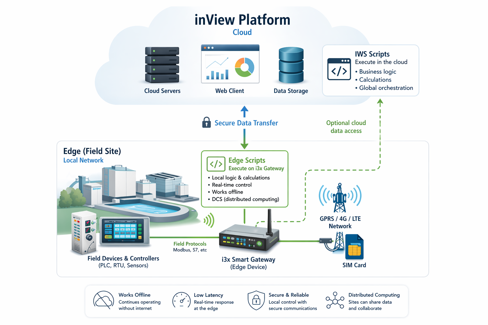

<!-- talk:
- Top: inView cloud — IWS scripts execute here, all variables, alarms, history
- Bottom: two locations — each with an i3x gateway running Edge Scripts
- Arrows to cloud: sync, optional, when internet is available
- Inside each zone: gateway reads field devices (PLCs, sensors), executes script locally
- Subtle line between zones: indirect communication through cloud when available
- Offline OK badge: that's the key — the script doesn't stop when internet goes down
-->

---

# Edge Scripts

Demo
<!-- slide: 5/30 — Edge Scripts: Architecture -->

<!-- talk:
RSabo
Demo to talk about:
+  Main method + additional methods
+  DeviceType + Unlink
+  Right many: recommandations for sufixes + 
-->

---
<!-- slide: 6/30 — Edge Scripts: Flows -->
# Flows

NO-Code IDE with scripts? Let's draw the script.

- Flow programming to draw scripts - **Visual presentation script**
- Same behavior as written edge scripts - you also can switch to code if you prefere
- Debug mode - easly simulate your flow

<!-- talk:
- TODO
-->

---

<!-- slide: 7/30 — Edge Scripts: Simulator Mode -->
# Simulator Mode

Demo

<!-- talk:
- TODO
-->

---

<!-- slide: 8/30 — AI & LLMs: The Opportunity -->
# InWise - LLMs with InView

**Large Language Models are transforming how we interact with software.**

LLMs can now understand context, generate code, and answer domain-specific questions — without retraining, without integration complexity.

Two immediately valuable use cases at InView, two **agents**:

- **Knowledge access** — the platform has rich documentation; let users query it conversationally
- **Script generation** — IWS scripting requires C# knowledge; let AI write the code instead

To be continued...

<!-- talk:
- LLM adoption is no longer experimental — it's production-ready
- We identified the two highest-value touch points in the platform
- Both are available inside the platform — no external tools, no context switching
- Goal: democratization — non-developers can use the platform effectively
- More AI features are planned beyond Q1
-->

---

<!-- slide: 9/30 — ChatBot: Docs -->
# InView Docs Agent

**Ask the platform a question. Insight the documentation and user manual.**

The Docs Agent is trained on the official inView documentation — Editor, Configurator, drivers, components, properties...

Users ask questions in natural language and receive precise, contextual answers.

- No need to search through documentation pages manually
- Available directly inside the platform — no context switching
- Multilanguage supported

**Who benefits:** New team members, clients configuring independently, support engineers resolving tickets faster.

<!-- talk:
- RAG-based: responses are grounded in the actual documentation, not hallucinated
- Platform-specific: non-platform questions are out of scope
- Reduces the support burden — users find answers themselves
- Especially powerful for onboarding new clients or team members
-->

---

<!-- slide: 10/30 — ChatBot: Docs — Demo -->
# InView Docs Agent

Demo

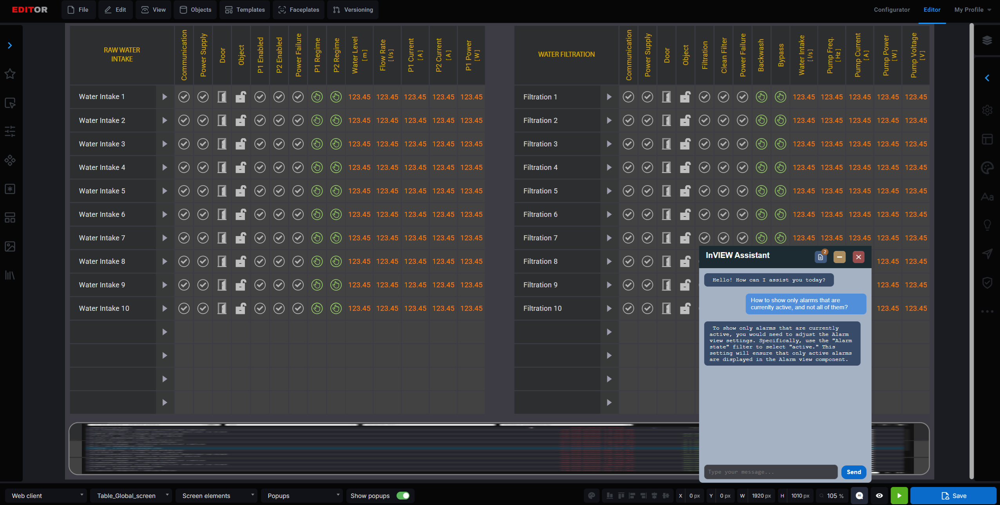

<!-- talk:
- Live demo — open the Docs ChatBot in the platform
- Ask a question about a specific component or property
- Show how the answer references documentation directly
-->

---

<!-- slide: 11/30 — Coding Agent -->
# Coding Agent

**Describe what the script should do — AI writes it.**

Writing Scripts requires C# knowledge. The Coding Agent removes that barrier — users describe the desired automation in plain language, and the agent generates ready-to-use code.

- **Analyze** — describe the script; identify potential problems
- **Write** — one click syncs the generated code directly into the Scripting editor; iterate in chat until correct
- **Variables Context** — drag variables from the Configurator into the chat; the understand the available resources, available variables — no broken references

Non-coding questions are automatically rejected — the agent stays focused on scripts.

<!-- talk:
- Democratizing automation — non-developers can now create scripts
- APPLY replaces or appends — user controls the behavior
- Variable context eliminates the most common scripting error: referencing a variable that doesn't exist
- Session context maintained per userId:scriptId — iterations feel natural
- Reduces burden on the support team for script-related requests
-->

---

<!-- slide: 12/30 — Coding Agent -->
# Coding Agent

Demo

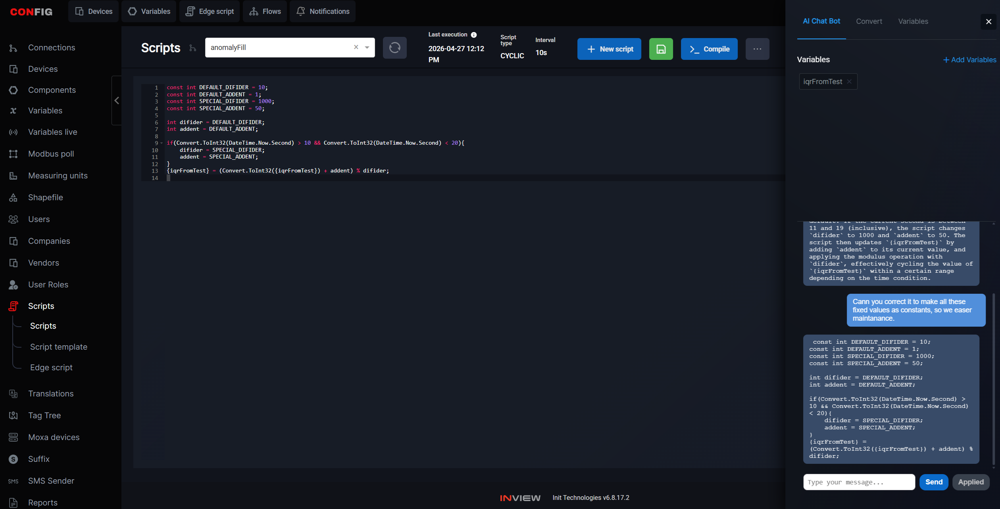

<!-- talk:
- Live demo — open Coding Agent in the Scripting section
- Describe an automation; show the generated C# snippet
- Drag a variable into the chat context; regenerate — show it uses the real variable name
- Click APPLY — code lands in the editor
-->

---

<!-- slide: 13/31 — Responsive: Web Positioning Concepts -->
# Responsive Client

**No more static absolute positioning needed while drawing in InView Editor**

**Absolute positioning** — every element has hardcoded pixel coordinates
- Works perfectly at the design resolution
- Manually create a separate layout for each target resolution: Desktop, Mobile

**Relative positioning** — elements are defined by their relationship to each other, not their exact position. Position while rendering

- One layout definition → correct on any screen
- The standard approach for modern web UIs since ~2015. Still new for SCADA

---

<!-- slide: 14/31 — Responsive Client: Flex Layout -->
# Responsive Client — Flex Layout

**Brand new InView's responsive client is built on CSS Flexbox — the web standard.**

Screens are structured in layers:

- **Containers** — invisible zones that define a layout direction (`flex-row →` or `flex-column ↕`)
- **Components** — occupy the space the container assigns them (`flex: 1`, `flex: 2` for proportional sizing)
- **Grid layout** - multiple containers present as view

When the screen expands or shrinks, the container redistributes space automatically. Components follow.

**Result:** The same screen definition renders correctly on a 10" industrial panel and a 27" monitor — without any manual adjustment.

<!-- talk:
- Flex is a CSS standard, well understood by web developers
- Key concept: containers know directions, components know proportions
- Nesting is the key to complex layouts: a flex-column can contain a flex-row, which contains sub-panels
- No need for a separate mobile configuration — one screen works everywhere
- Existing projects are unaffected — both positioning modes coexist in the platform
-->

---

<!-- slide: 15/31 — Responsive Client: Demo -->
<!-- slide: 15/31 — Responsive Client: Demo -->
# Resonsive client

Demo
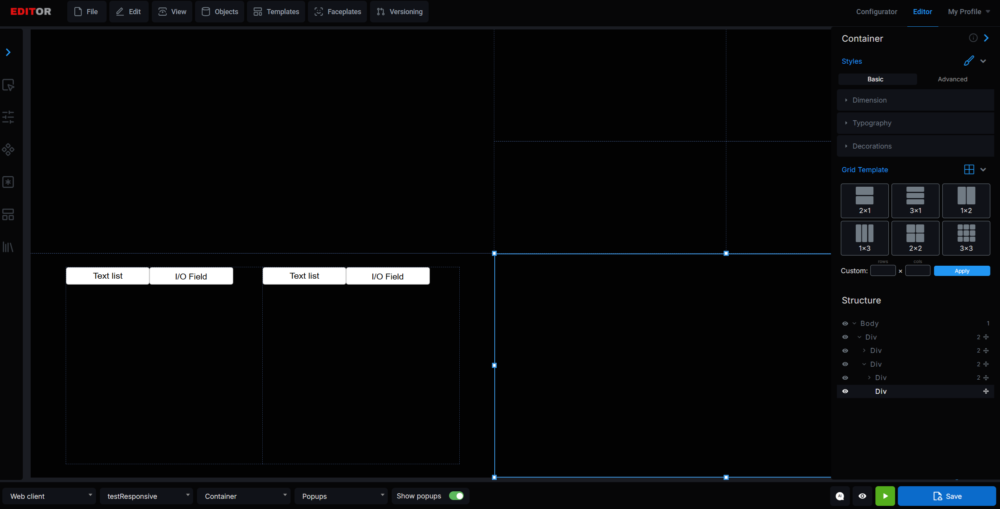

<!-- talk:
- Live demo — show the same SCADA screen on a wide monitor and a smaller panel
- Show the Editor: containers with flex direction indicators, nested structure
- Resize the browser window — show elements redistributing in real time
-->

---

# Resonsive client - Flexbox

<!-- slide: 16/31 — Responsive Client: Flex Illustration -->

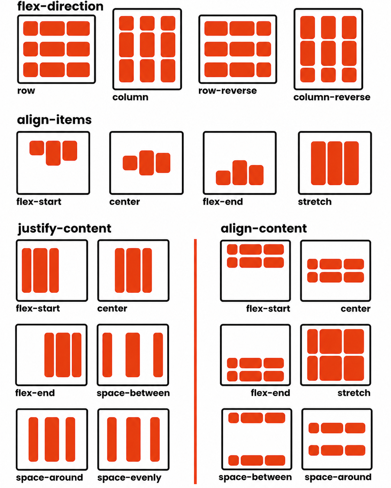

<!-- talk:
- Left: absolute positioning — hardcoded pixel values, no adaptation
- Right: flex layout — containers with direction, components fill assigned space proportionally
- The dashed borders are the invisible containers — they define structure, not appearance
- flex: 1 vs flex: 2 means the right panel gets twice the width of the left panel
- This ratio is maintained at any screen size automatically
-->

---

<!-- slide: 17/31 — App UX: Intro -->
# App UX Improvements

**Listening to the people who use inView as every day tool.**

>> TODO
App team (Frontline fighters), Source orked through a backlog of UX feedback collected from active users — operators, configurators, and engineers who run the platform daily. The list was long.

We delivered a significant number of tasks. Three of them highlighted as immediately visible improvements:

- **WYSIWYG Quick Preview** — see the screen as the client renders it, without leaving the Editor
- **Advanced Search** — wildcard search in the Configurator for projects with hundreds of variables
- **Follow Live Values** — personal variable groups to monitor across connections in one place

<!-- talk:
- The App team ran a feedback cycle with users who work in the Configurator regularly
- Many small and medium tasks were completed — these three are the most visible
- Combined effort: FE 10 days, BE 14 days
- Common theme: reduce the number of steps and context switches in daily work
-->

---

<!-- slide: 18/31 — WYSIWYG -->
# WYSIWYG — Quick Preview

**See how the screen looks — without saving, without switching to the client.**

Before this feature, validating a screen design meant: save the configuration → log in to the client → navigate to the screen → review → go back and edit. Every iteration meant that full loop.

Now: click the **Quick Preview** button (eye icon) in the Editor toolbar — the runtime view opens in the same window, instantly.

- No saving required — preview works on unsaved configuration
- No client login — no credentials, no session, no navigation
- No risk of losing work — the preview is read-only, configuration is not touched

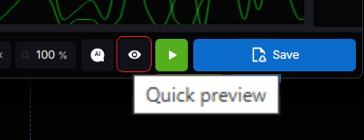

<!-- talk:
- Biggest time-saver for people who design screens frequently
- Also works for mobile/desktop layout preview — shows the correct configuration per device type
- The eye icon is in the Editor toolbar — one click, instant feedback
-->

---

<!-- slide: 19/32 — WYSIWYG: Demo -->

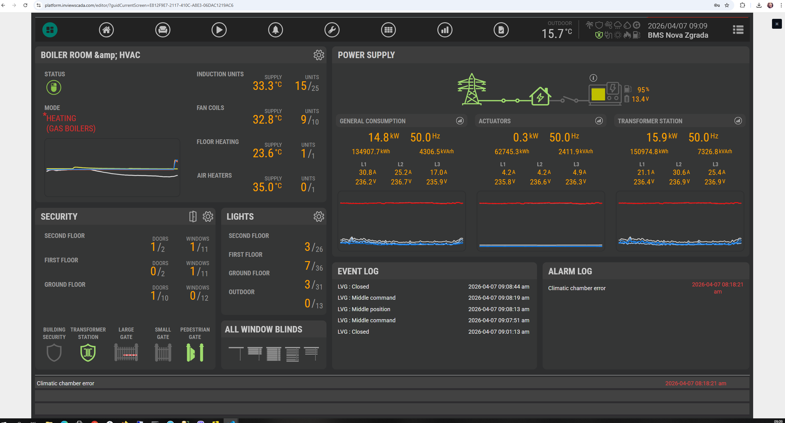

<!-- talk:
- Live demo — open the Editor, make a small change, click Quick Preview
- Show the screen renders in real time without saving
- Point out: no client login, no save, no navigation — the result is right there
-->

---

<!-- slide: 20/32 — Advanced Search & Follow Live Values -->
# Advanced Search & Follow Live Values

**Follow Live Values** — personal variable groups

On the Live Values page, users create named groups and add variables from any connection. The group works as a filter — one page, all the values you care about, regardless of which connection they belong to.

**Advanced Search** — wildcard search in the Configurator

Activated automatically when the search field contains quotes (`"` or `'`). Use `#STAR#` for :

| Query | Matches |
|-------|---------|
| `"temperature sensor"` | Exact names including whitespace |
| `"temp#STAR#Sensor"` | temperatureSensor, tempMaxSensor… |
| `"#STAR#Sensor"` | Any variable ending with Sensor |
| `"temp#STAR#"` | Everything starting with temp |

Especially useful on projects with hundreds of variables across multiple drivers.

<!-- talk:
- Advanced Search: no UI change needed — quoting the search term activates wildcard mode automatically
- Follow Live Values: previously, monitoring variables from two different connections meant jumping between pages
- Groups are personal — each user defines their own monitoring view
- Both features address the same root problem: too many clicks to get to the data you need
-->

---

<!-- slide: 21/32 — App UX: Demo -->

<!-- talk:
- Live demo — open the Editor, make a small change, click Quick Preview
- Show the screen renders in real time without saving
- Then show Advanced Search: type "temp*" in quotes → wildcard results
- Then show Follow Live Values: open a group with variables from multiple connections
-->

---

<!-- slide: 22/30 — Quality: Challenges -->
# Quality in Complex Platforms

**A SCADA platform grows fast. Quality processes don't keep up automatically.**

InView has lof of editor components, differnent drivers behaviour, thousands of configurable properties.
Every release brings new features.
Every deploy carries risk.

The challenges are well-known in any platform of this scale:

- **Documentation gaps** — new features ship, documentation doesn't follow; teams rely on tribal knowledge
- **Testing by memory** — what gets tested depends on who tests it, not on a defined process
- **No visibility after deploy** — is this release better or worse than the last one?

These aren't bugs. They're process gaps — and they compound over time.

<!-- talk:
- This is not a feature delivery — it's a change in how the platform is maintained
- The problems are familiar to anyone who has worked on a growing software platform
- We made a deliberate investment in quality infrastructure this quarter
- Three specific deliveries: Documentation, TestRails, Automated Tests
-->

---

<!-- slide: 23/30 — Quality: Documentation -->
# Documentation

**Every component explained. Every property defined.**

The Editor and Configurator are now fully documented — every component, every property, its accepted values, its default, and when to use it.

- **Editor** — all visual components, display logic, binding properties
- **Configurator** — drivers, connections, tags, scripts; e.g. ModbusTCP driver with all fields described

Goal: any team member or client — regardless of experience — can open the documentation and understand exactly what an option does without guessing or asking support.

**Available on SharePoint:** `INIT > Documents > Teams > QA`

> The same knowledge is now also accessible via the **InView Docs Agent** — ask a question in natural language, get an answer grounded in this documentation.

<!-- talk:
- Reduces configuration errors — users understand what they're setting
- Reduces support interventions — self-service answers
- The ChatBot connection is deliberate: documentation is the source, ChatBot is the interface
- Working version in Word; final published on SharePoint
-->

---

<!-- slide: 21/32 — App UX: Demo -->

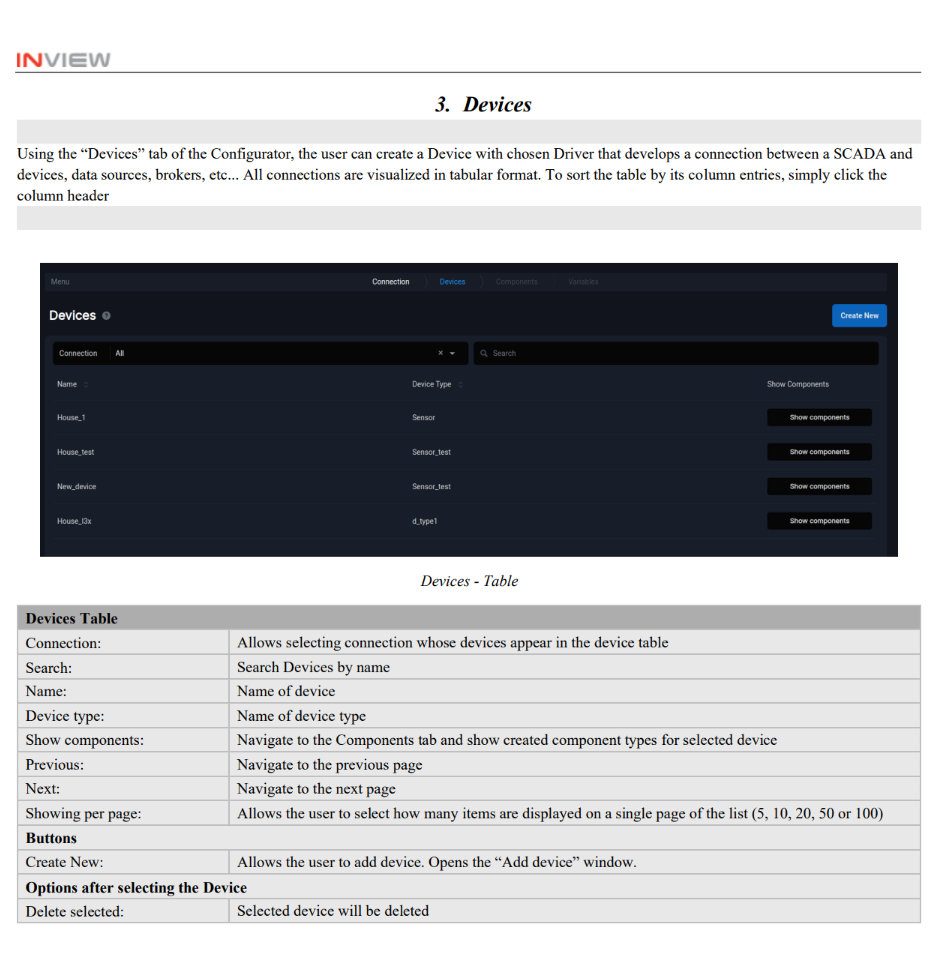

<!-- talk:
- Live demo — open the Editor, make a small change, click Quick Preview
- Show the screen renders in real time without saving
- Then show Advanced Search: type "temp*" in quotes → wildcard results
- Then show Follow Live Values: open a group with variables from multiple connections
-->

---
<!-- slide: 21/32 — App UX: Demo -->

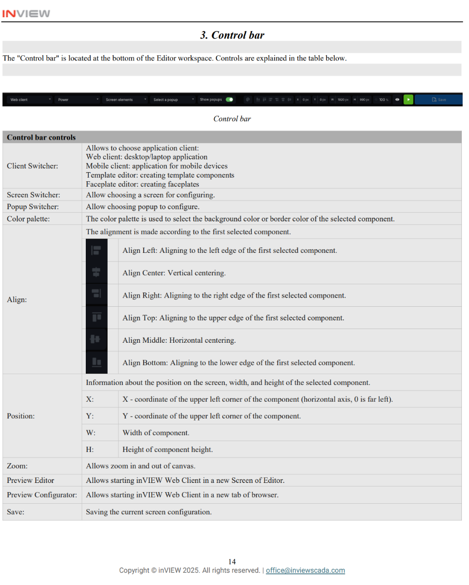

<!-- talk:
- Live demo — open the Editor, make a small change, click Quick Preview
- Show the screen renders in real time without saving
- Then show Advanced Search: type "temp*" in quotes → wildcard results
- Then show Follow Live Values: open a group with variables from multiple connections
-->

---

<!-- slide: 24/30 — Quality: TestRails + Automated Tests -->
# Test Rails & Automated Tests

**Documented tests. Automated execution. Proof after every deploy.**

**TestRails — test case management**

Before: testing tracked in spreadsheets, coverage depending on who ran it and when. Now: all test cases are migrated into TestRails, organized by procedure, with milestone traceability and Jira integration. 100% QA team adoption reached in Q1.

**Automated Tests (Cypress)**

The highest-risk procedures are now covered by automated end-to-end tests that run on every deploy:

| Procedure | What it covers |
|-----------|----------------|
| **Wells CRUD** (Boomerang) | Adding, renaming, retiring, deleting Wells |
| **Advanced Configurator** | Most commonly used Configurator components |
| **Editor / Client** | Consistency between configuration and client display |

After each run: a structured **PDF report** is generated and delivered automatically to defined addresses — with pass/fail per test case and history over time.

**The loop is closed:** documented in TestRails → executed automatically → report proves the result.

<!-- talk:
- TestRails replaces the spreadsheet chaos — same cases, professional tooling, auditable history
- Cypress covers the operations whose failure most directly impacts clients
- The PDF report means stakeholders don't need to ask "how did the release go?" — they get the answer automatically
- This is the foundation for expanding coverage in Q2 and beyond
-->

---

<!-- slide: 21/32 — App UX: Demo -->

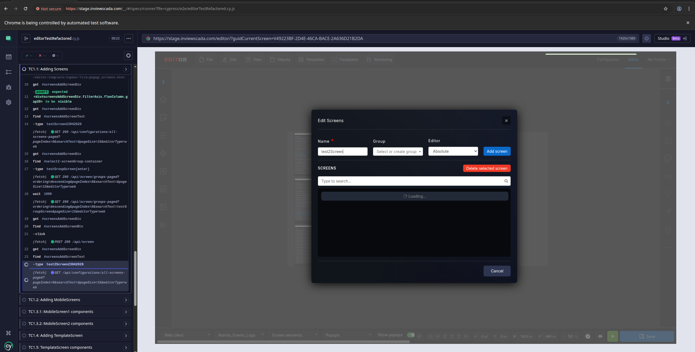

<!-- talk:
- Live demo — open the Editor, make a small change, click Quick Preview
- Show the screen renders in real time without saving
- Then show Advanced Search: type "temp*" in quotes → wildcard results
- Then show Follow Live Values: open a group with variables from multiple connections
-->

---

<!-- slide: 21/32 — App UX: Demo -->

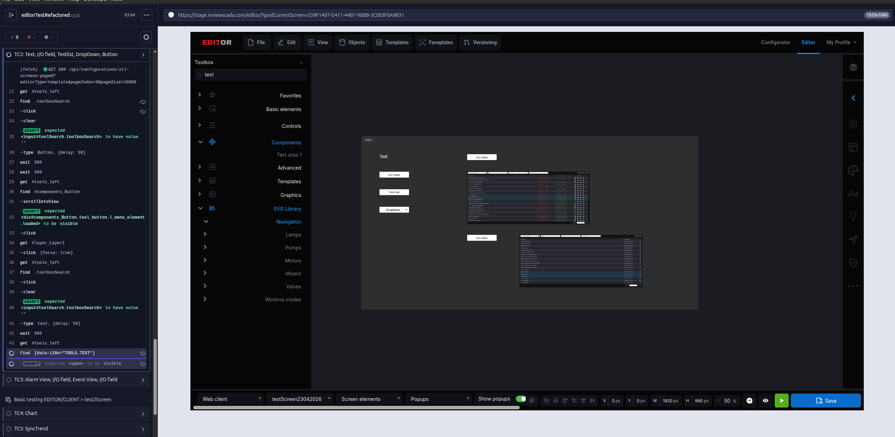

<!-- talk:
- Live demo — open the Editor, make a small change, click Quick Preview
- Show the screen renders in real time without saving
- Then show Advanced Search: type "temp*" in quotes → wildcard results
- Then show Follow Live Values: open a group with variables from multiple connections
-->

---

<!-- slide: 21/32 — App UX: Demo -->

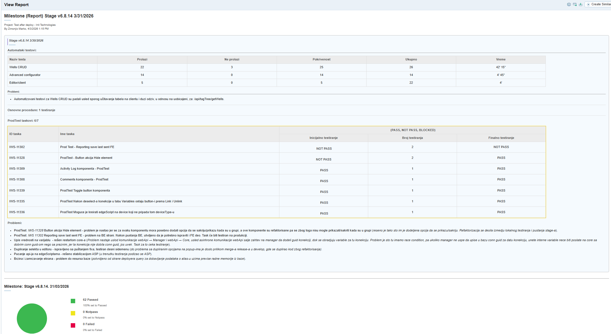

<!-- talk:
- Live demo — open the Editor, make a small change, click Quick Preview
- Show the screen renders in real time without saving
- Then show Advanced Search: type "temp*" in quotes → wildcard results
- Then show Follow Live Values: open a group with variables from multiple connections
-->

---

<!-- slide: 30/35 — Tool Integrations -->
# Highlights from 2025

**Missed from last year SPS Expo in Nurnmberg** 
- InView Forecast
- Anomaly Detecion
- **Inegration tools** - Power BI, Grafana, Web Hook
---

<!-- slide: 28/35 — Self Prediction -->
# InView Forecast — Future Variable Value 

**The platform predicts what a variable will be — before it gets there.**

Every variable has a history. InView Forecast uses that history to train a model and generate a forecast — a predicted future value with a confidence range. The prediction updates incrementally as new data arrives.

**How it works:**

- **Model**: LSTM neural networks + Random Forest — two complementary approaches, combined for accuracy
- **Feature selection**: Pearson / Spearman / Mutual Information — the model identifies which other variables correlate with the target
- **Incremental updates**: the model improves continuously without full retraining

**What it enables:**

- Set an alarm on the *predicted* value — get notified before the threshold is breached, not after
- See the trend before it happens — operators gain reaction time
- Detect slow-moving problems that real-time monitoring misses

Easy AI tool for everyone
<!-- talk:
- LSTM is a type of recurrent neural network well-suited for time-series; Random Forest adds robustness
- Feature selection means the model can discover that tank A level predicts pump B failure — without manual configuration
- Incremental updates mean the model stays current without expensive retraining cycles
- The prediction is a native platform value — it can be used anywhere a variable can: alarms, scripts, dashboards
- TODO: add context from a specific client or test that validated accuracy
-->

---

<!-- slide: 29/35 — Self Prediction: Demo -->

# InView Forecast

Demo

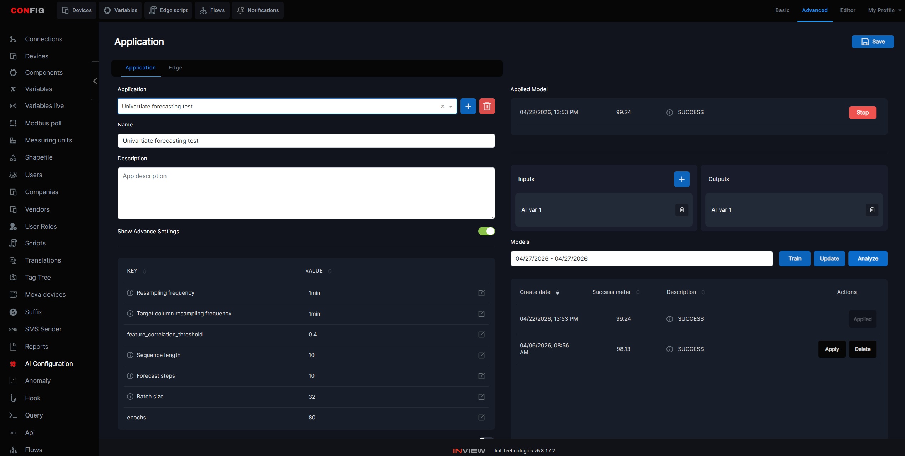

<!-- talk:
- Show the trend chart with the predicted value overlaid — the forecast line extending beyond current time
- Show the confidence band (if visible in the UI)
- Show an alarm configured on the predicted value threshold
-->

---

<!-- slide: 26/35 — Anomaly Detection -->
# Anomaly Detection

**Stop setting alarms manually. Let the platform learn what normal looks like.**

Traditional SCADA alarm configuration is static — an engineer sets a threshold, and the alarm fires when the value crosses it. This works for known limits, but misses gradual drift, timing anomalies, and patterns that are hard to express as a single number.

**Anomaly Detection observes the variable's behavior over time and flags deviations automatically.**

Six detection algorithms are available — each targeting a different class of anomaly:

| Algorithm | What it catches |
|-----------|----------------|
| **Out-of-Range** | Values outside defined min/max (auto-learned or manual) |
| **Timeout** | Missing measurements beyond the 95th-percentile interval |
| **Rate-of-Change** | Values changing faster than historically normal |
| **IQR** | Statistical outliers using Q1/Q3 bounds |
| **Z-Score** | Deviations beyond ±3 standard deviations |
| **Ensemble** | Anomaly only when all selected algorithms agree — fewer false positives |

**Configurable per variable:** choose which algorithms to apply, set auto or manual mode, combine them in ensemble.

<!-- talk:
- Key message: users no longer need to know the exact threshold — the system learns it from historical data
- Auto mode: the platform sets the bounds; manual: the user can override
- Ensemble is the conservative choice — fires only when multiple algorithms agree
- The detection runs in real time on the live Kafka stream — zero latency from detection to alert
- Anomaly events are stored and visible in the alarm/event history like any other alarm
-->

---

<!-- slide: 27/35 — Anomaly Detection: Demo -->
# Anomaly Detection

Demo

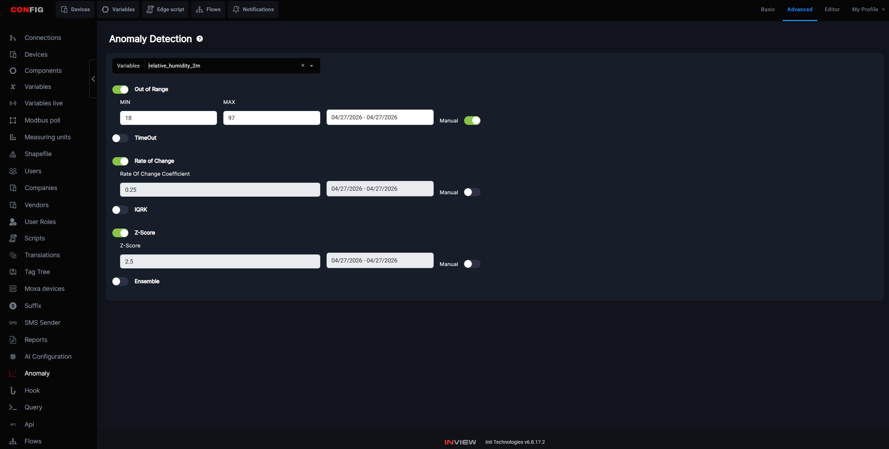
<!-- talk:
- Show the Anomaly Detection configuration: variable selected, algorithms enabled, mode set
- Show a live or recorded anomaly event in the alarm history
- If available: show the visual anomaly marker on the trend chart
-->

---

<!-- slide: 30/35 — Tool Integrations -->
# Integrations — Power BI, Grafana, WebHooks

**inView data, in the tools the business already uses.**

SCADA data is operations data — but operations data is also business data. Teams that live in Power BI or Grafana shouldn't need to switch to a different interface to see plant performance.

**Power BI**
Connect inView variable history directly to Power BI. Build operational reports and executive dashboards using the same data that drives the SCADA screen — no manual export, no CSV.

**Grafana**
inView acts as a data source for Grafana. Teams already running Grafana for IT/DevOps monitoring can add OT data to the same dashboards, with the same alerting and visualization tools.

**WebHooks**
Event-driven HTTP callbacks — when a variable changes, an alarm fires, or a condition is met, inView sends a POST to any external endpoint. Connect to Slack, Teams, custom APIs, ERP systems, or any HTTP-capable service.

<!-- talk:
- The common theme: inView as a data source and event emitter, not a closed silo
- Power BI: the business layer gets OT data in the tool they already know
- Grafana: unified monitoring for IT+OT on one pane of glass
- WebHooks: event-driven integration without polling — low latency, low coupling
- These are native platform features, not third-party connectors
-->

---

# Power BI
<!-- slide: 31/35 — Integrations: Power BI Demo -->
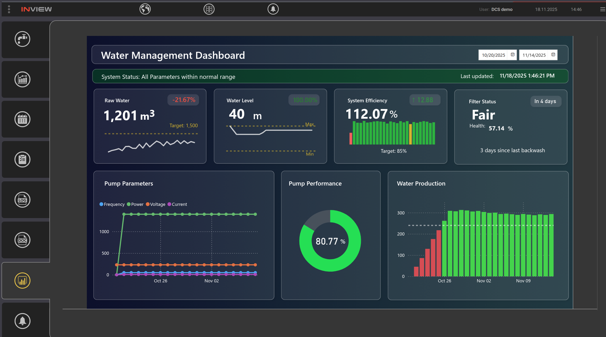

<!-- talk:
- Show a Power BI report built from inView variable history
- Point out: this is live operational data, not a static export
-->

---

# Grafana
<!-- slide: 32/35 — Integrations: Grafana Demo -->
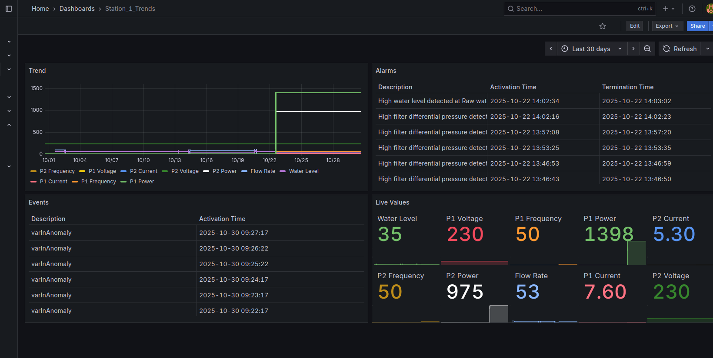

<!-- talk:
- Show the Grafana dashboard with inView variable data
- If available: show the data source configuration pointing to inView
-->

---

# Hooks
<!-- slide: 33/35 — Integrations: WebHooks Demo -->

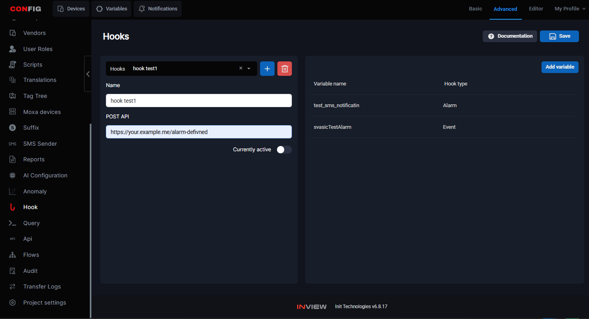

<!-- talk:
- Show the webhook configuration: event trigger, target URL, payload
- If available: show the delivery log confirming events were sent
- Example: alarm fires in inView → POST to Slack → notification appears in the team channel
-->

---

<!-- slide: 34/34 — Q&A -->
# Q&A

**Questions?**

*INIT Technologies — inView Web SCADA*

<!-- talk:
- Thank everyone for their attention
- Questions and comments
- Next newsletter: Q2 2026
-->
