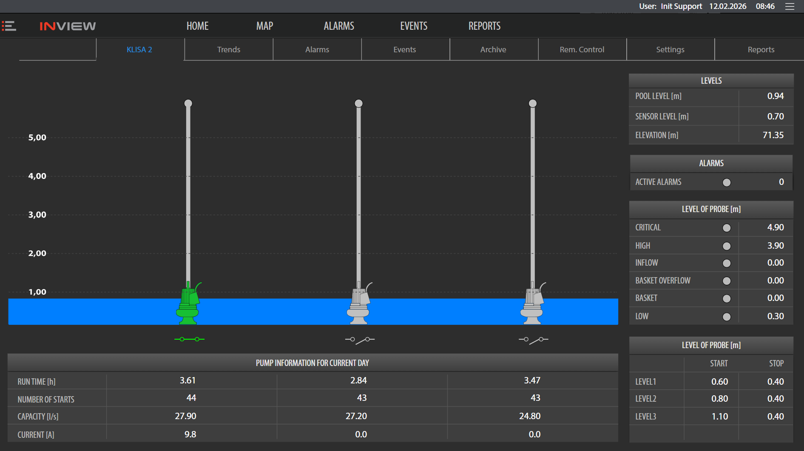
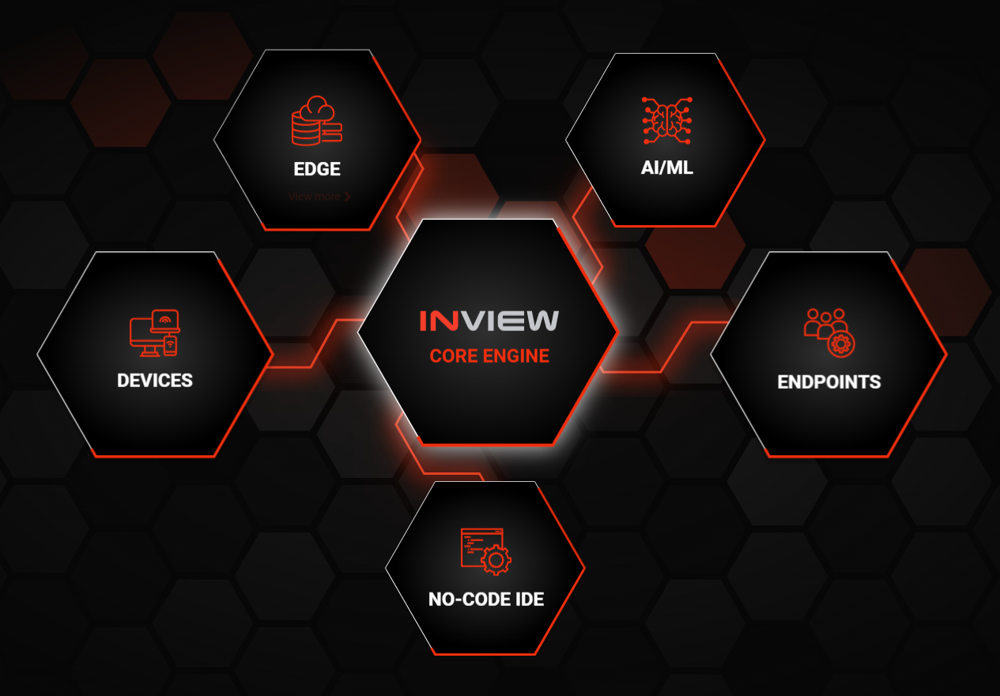
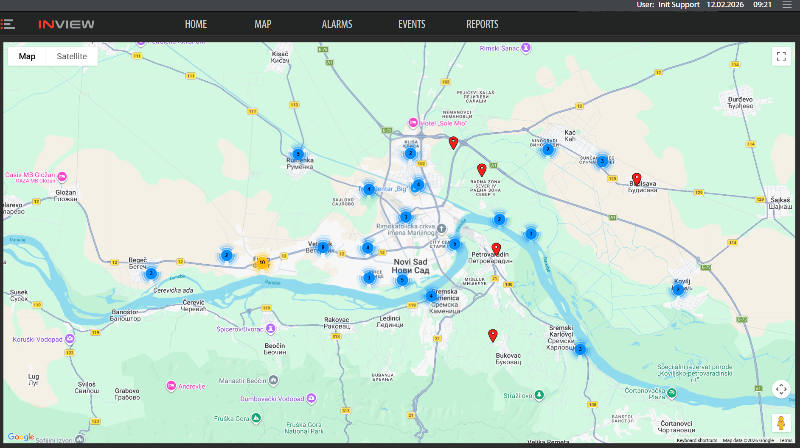
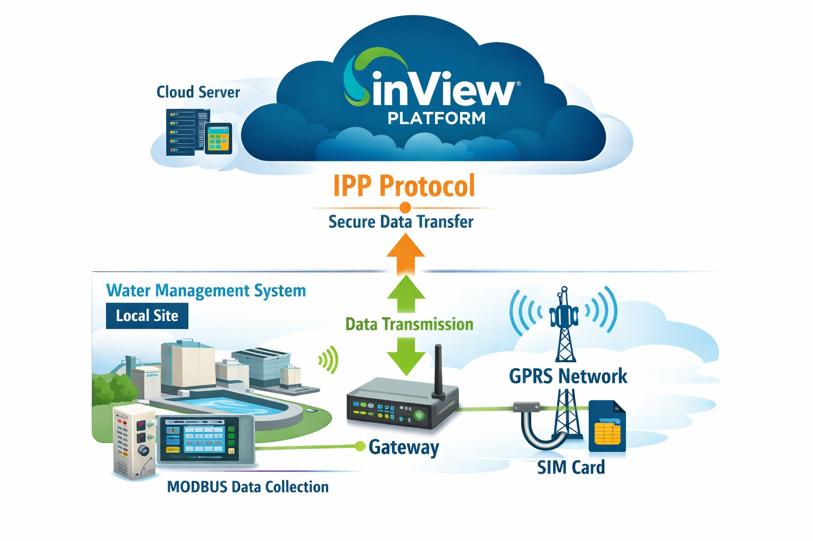
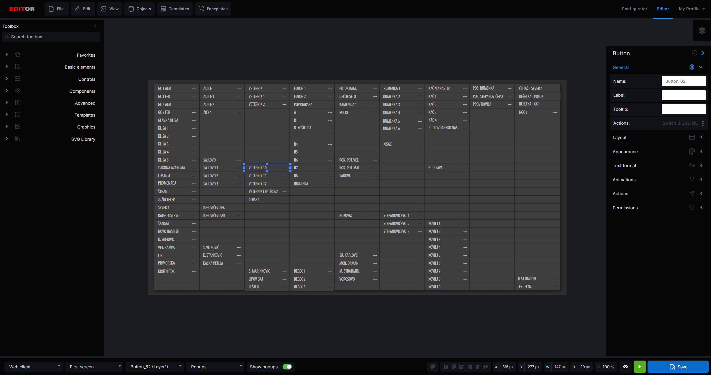
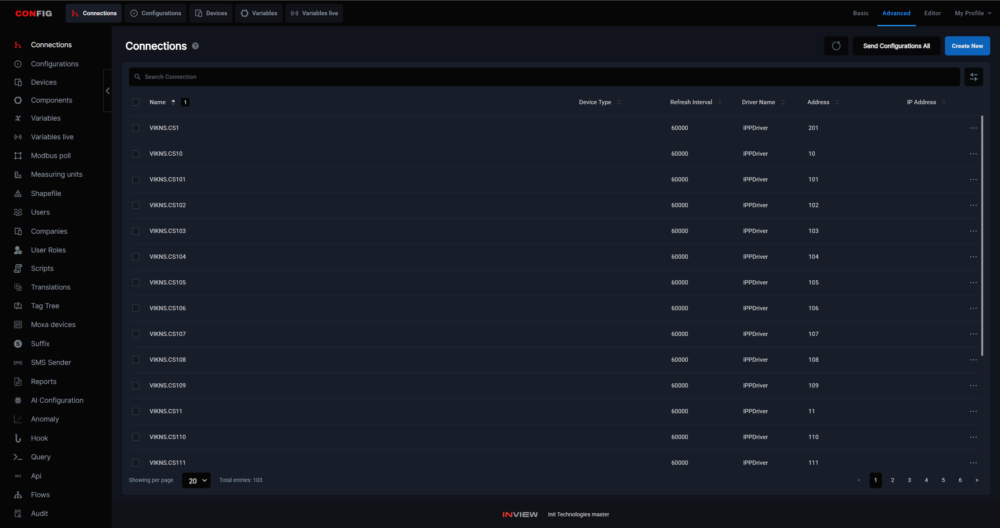
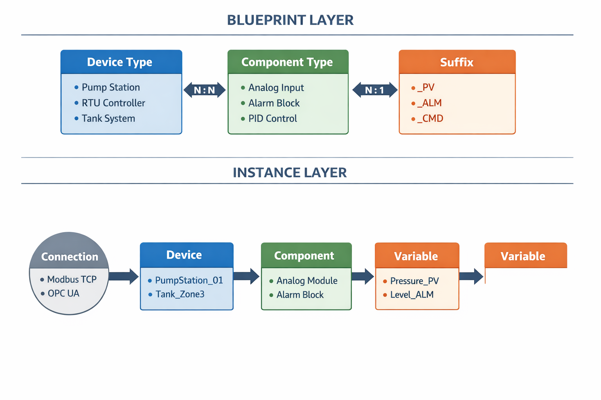

# SCADA System for Water Management
## Distributed Location Monitoring

**Presentation Overview**

---

# What is SCADA?

**Supervisory Control and Data Acquisitionsdf sdf**

- Real-time monitoring and control system
- Remote facility management
- Data collection and analysis
- Automated decision making

**Key Benefits:**
- 24/7 monitoring capability
- Reduced operational costs
- Improved response times
- Enhanced system reliability

---

# Water Management Challenges

**Distributed Infrastructure**
- Multiple remote locations
- Vast geographical coverage
- GPR as communication

**Critical Needs:**
- Real-time water level monitoring
- Pressure and flow control
- Leak detection systems
- Pump station management
- Reservoir level tracking

---

# System Architecture

## SCADA Components

**Field Devices (RTUs/PLCs)**
- Sensors and meters
- Actuators and valves
- Local controllers

**Communication Network**
- Cellular links (GPRS communication / SIM cards)
- InView gateway i51 (using IPP -> TCP sockets)
- InView gateway i3x (using I3X -> MQTT)

---

# Web Client

**Table review**
  - Sound alarming
  - Locations overview

**Single stations review**
  - Overview
  - Trends analises
  - Alarms/Events view
---
# Editor 

## How is it made?

**Single page components**

  - Buttons management
  - Link variables to value
  - Link variables to states

**Tempaltes and sufixes**

  - Prefix - sufix linking
  - TagTree

**Mobile screens**
  - faceplates and templates
---

# Configurator

## Basics

**Connection management**

  - IPP driver
  - i3x driver
  - Other drivers (MQTT, OPCUA, S7)
**Variable managegement**

  - Internal vs live
  - Loggability
  - Alarms and Events

---

# Configurator

## Devices and components management 

**Device**
  - Add Device vs Connection
**Component**
  - N-N with Device
**Sufix**
  - Batch handle
  - Unlink variable

---

# Configurator

## Scripting

**Scripts**
  
  
  - InView C#

**Edge Scripts**
  
  
  - i3x only

**Script Templates**

---

# Questions & Discussion

**Thank you for your attention!**

Contact Information:
- Technical Support
- Implementation Team
- Follow-up Sessions
