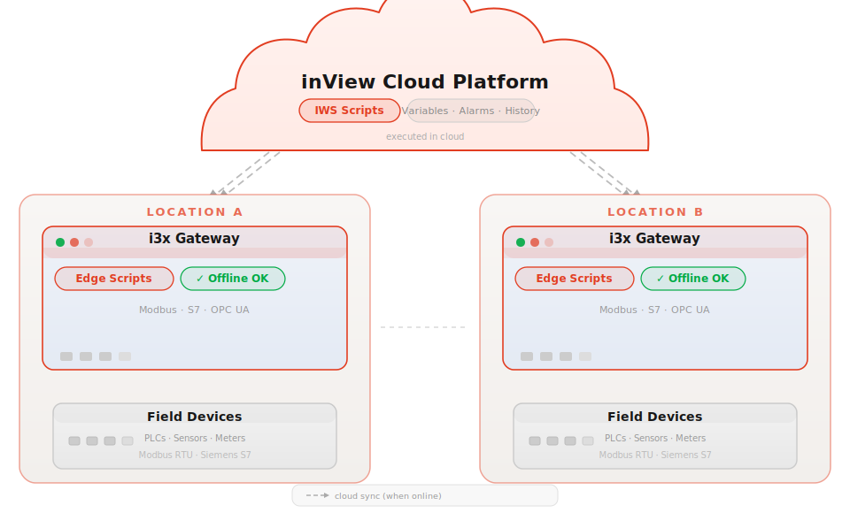
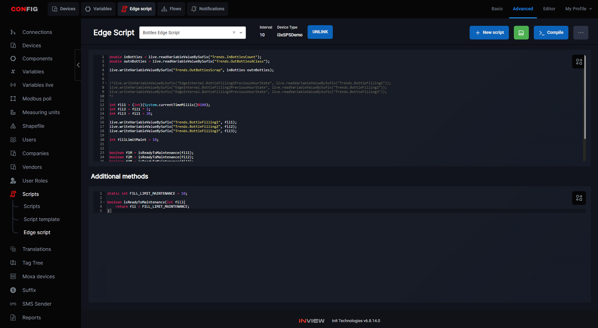
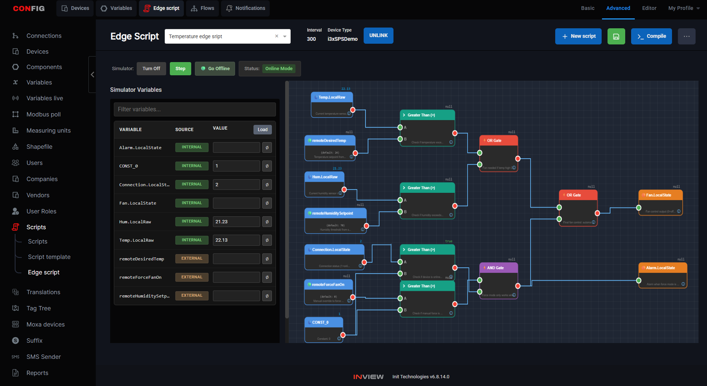
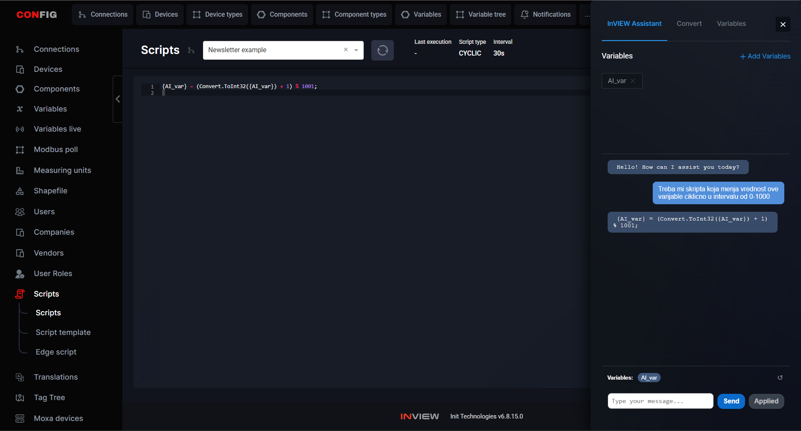
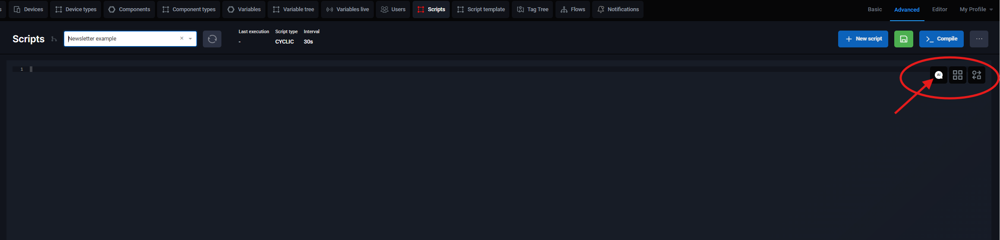
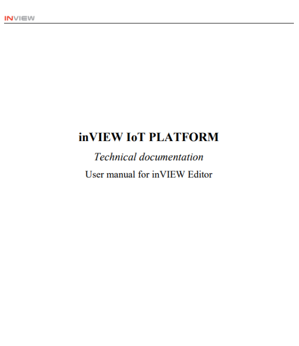
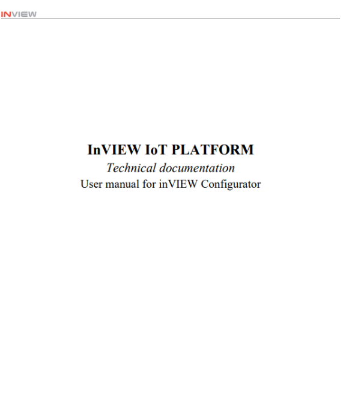
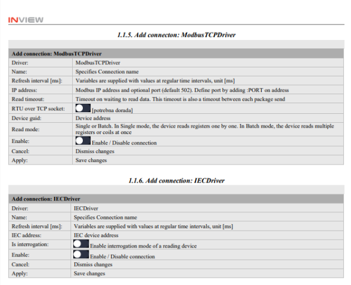
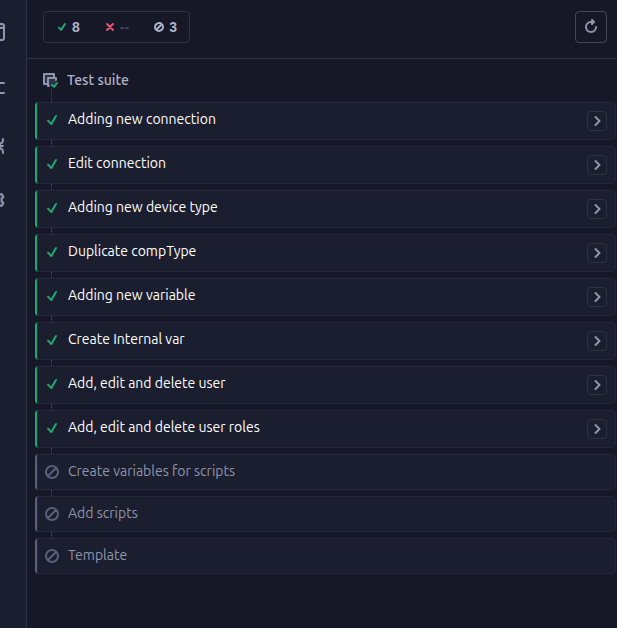
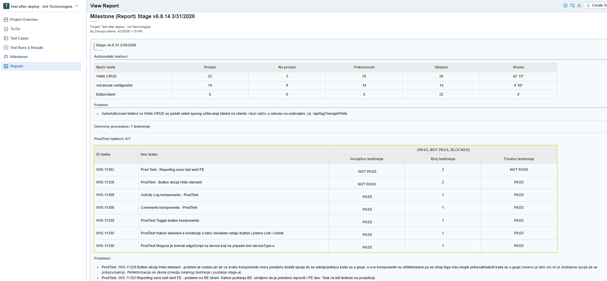

<!-- slide: 1/30 — Title slide -->
# inView IIoT Platform
## Newsletter Q1 2026

<!-- talk:
- Welcome to the Q1 newsletter presentation
- Today we cover the biggest deliveries of this quarter
- 90 minutes, 6 topics + Q&A
-->

---

<!-- slide: 2/30 — Agenda -->
# Agenda

- Edge Scripts — Flows & Simulator
- inView ChatBots — Docs & Coding Agent
- Responsive Client
- App Improvements
- Quality Guarantee
- Highlights from 2025
- Q&A

<!-- talk:
- Let's get started
-->

---

<!-- slide: 3/30 — Edge Scripts: Background -->
# Edge Scripts

IWS scripts have always been a powerful tool — C#-like code that reads and writes variables, executes logic, automates processes. But everything runs **in the cloud**.

The i3x gateway sits on-site: reads devices, PLCs and sensors, sends variables to the cloud. It has processing power — and it's always there, regardless of internet connectivity.

**The question was:** why not push the script directly to the gateway?

- Location without stable internet → the script must run autonomously
- Real-time reaction to events → no cloud round-trip latency
- The gateway already knows all local variables — no need to go to the cloud

<!-- talk:
- IWS scripts: powerful, but cloud-dependent
- i3x: our gateway, on-site, reads Modbus/S7/OPC UA
- Idea: deploy the script directly to i3x → it executes locally
- Cloud is not needed for execution — only for sync when connection is available
-->

---

<!-- slide: 4/30 — Edge Scripts: How it works -->
# Edge Scripts

The developer writes a script **almost identically** to an IWS script — similar syntax, same variable access, same mental model.

The only difference: the script is deployed to the **i3x gateway**.

- Executes **locally** on the gateway — the user doesn't notice
- Works even when **there is no internet connection**
- Can read variables from the cloud — remote locations can communicate

**Result:** automation that lives at the network edge, independent of the cloud, but part of the same platform.

<!-- talk:
- Same syntax as IWS — no new learning curve
- Deploy to gateway = script "lives" locally
- Offline resilience: location without internet still executes logic
- Cloud read: can consume cloud variables → DCS between locations
- Key point: the user writes the same code, the platform knows where to execute it
-->

---

<!-- slide: 5/30 — Edge Scripts: Architecture -->

<!-- talk:
- Top: inView cloud — IWS scripts execute here, all variables, alarms, history
- Bottom: two locations — each with an i3x gateway running Edge Scripts
- Arrows to cloud: sync, optional, when internet is available
- Inside each zone: gateway reads field devices (PLCs, sensors), executes script locally
- Subtle line between zones: indirect communication through cloud when available
- Offline OK badge: that's the key — the script doesn't stop when internet goes down
-->

---

<!-- slide: 5/30 — Edge Scripts: Architecture -->

---

<!-- slide: 5/30 — Edge Scripts: Architecture -->

<!-- talk:
- Top: inView cloud — IWS scripts execute here, all variables, alarms, history
- Bottom: two locations — each with an i3x gateway running Edge Scripts
- Arrows to cloud: sync, optional, when internet is available
- Inside each zone: gateway reads field devices (PLCs, sensors), executes script locally
- Subtle line between zones: indirect communication through cloud when available
- Offline OK badge: that's the key — the script doesn't stop when internet goes down
-->

---
<!-- slide: 6/30 — Edge Scripts: Flows -->
# Flows

NO-Code IDE with scripts? Let's draw the script.

- Flow programming to draw scripts - **Visual presentation script**
- Same behavior as written edge scripts - you also can switch to code if you prefere
- Debug mode - easly simulate your flow

<!-- talk:
- TODO
-->

---

<!-- slide: 7/30 — Edge Scripts: Simulator Mode -->
# Simulator Mode

> ⚠️ TODO: Description of Simulator Mode — what it enables, how it works

<!-- talk:
- TODO
-->

---

<!-- slide: 8/30 — ChatBots: Intro -->
# inView ChatBots

**AI assistants built directly into the platform.**

Two chatbots, two purposes:

- **Docs** — answers questions about the platform using the official documentation
- **Coding Agent** — writes C# scripts based on natural language descriptions
- more coming...

<!-- talk:
- General LLM adoption — we've all seen how powerful this is
- Both chatbots available inside the platform, without leaving the context
- Goal: democratization — non-developers can use the platform effectively
-->

---

<!-- slide: 9/30 — ChatBot: Docs -->
# ChatBot: Docs

**Documentation available through conversation.**

> ⚠️ TODO: Fill in details — where it's available, what questions it covers, how RAG works

<!-- talk:
- TODO
-->

---

<!-- slide: 10/30 — Coding Agent: Intro -->
# Coding Agent

**Describe what the script should do — AI will write it for you.**

Writing C# scripts has always required programming knowledge. Users without technical experience couldn't create automations independently — the Coding Agent changes that.

- Available directly in the Scripting section, without leaving the context
- Generated code is applied with a single click (APPLY)
- Variables from the configurator can be included in the context

<!-- talk:
- Democratizing automation — non-developers can create scripts
- Reduces the burden on the support team
- Non-coding questions are rejected — focus is exclusively on scripts
-->

---

<!-- slide: 11/30 — Coding Agent: Open Chat -->
# Coding Agent — Open Chat

**Step 1: Describe it, AI generates it.**

A button in the Scripts screen opens the AI chat panel. The user describes the desired automation in natural language — the chatbot generates a C# snippet compatible with the platform's syntax.

<!-- talk:
- Snippet is ready to paste into the Scripting editor
- Non-coding questions are automatically rejected
-->

---

<!-- slide: 12/30 — Coding Agent: APPLY -->
# Coding Agent — APPLY

**Step 2: One click, code in the editor.**

Clicking APPLY syncs the generated code directly into the Scripting editor. Iterations are supported — the user requests changes in the chat until the code is correct.

<!-- talk:
- Default: replace. Optional: append
- Compile feedback available directly in the editor
- Session context is maintained per userId:scriptId combination
-->

---

<!-- slide: 13/30 — Coding Agent: Variables -->
# Coding Agent — Variables

**Step 3: Context that eliminates errors.**

Variables from the configurator can be included in the chat window. The model then generates code exclusively using the available system variables — eliminating errors caused by non-existent references.

<!-- talk:
- Drag & drop variables from the configurator into the chat
- If required variables are missing — APPLY is disabled with a clear message
-->

---

<!-- slide: 14/30 — Responsive Client: Problem -->
# Responsive Client

**Screens that adapt to every device — without manual adjustment.**

**Before:** Absolute positioning — every element has fixed coordinates and dimensions. On a mobile device or different resolution — unusable.

**Now:** Flex layout — elements know how they relate to each other, not where exactly they are.

<!-- talk:
- This is a fundamental change in how screens are rendered
- Same screen — correct on every device without developer intervention
-->

---

<!-- slide: 15/30 — Responsive Client: Flex Layout -->
# Responsive Client — Flex Layout

Screens are built in layers:

- **Containers** — invisible zones that define layout directions (horizontal / vertical)
- Containers can be nested — complex layouts without a single fixed coordinate
- **Components** — occupy the space the container assigns them

When the screen expands or shrinks — the container redistributes space automatically.

**Result:** The same screen on a 10" industrial panel and a 27" monitor — clean on both.

<!-- talk:
- Flex is a standard web approach (CSS Flexbox)
- No need for a separate mobile screen configuration
-->

---

<!-- slide: 16/30 — Responsive Client: Production -->
# Responsive Client — In Production

- Merge develop ↔ responsive branch: **done**
- Existing projects: **unaffected**
- 10 key components: **verified**
- Top menu rendering by screen type: **verified**

**Approach:** Released to production. Bugs are fixed incrementally based on real-world usage.

<!-- talk:
- This is not "all or nothing" — works alongside existing projects
- Mobile-first SCADA — competitive advantage
-->

---

<!-- slide: 17/30 — App Improvements: Intro -->
# App Improvements

**Features that speed up everyday work in the Configurator.**

- WYSIWYG — Quick Preview
- Follow Live Values
- Advanced Search

<!-- talk:
- Accumulated App team tasks — finally delivered in Q1
- FE: 10 days, BE: 14 days
-->

---

<!-- slide: 18/30 — WYSIWYG -->
# WYSIWYG — Quick Preview

**See how the screen looks — without saving, without login.**

Clicking the **Quick Preview** button (eye icon) in the Editor toolbar shows the runtime appearance of the screen directly in the same window.

- No saving the configuration
- No prior login to the client
- No risk of losing work — the previewer does not modify the configuration, only displays it

<!-- talk:
- Speeds up iteration when designing SCADA screens
- Mobile and desktop preview — shows mobile/desktop configuration
-->

---

<!-- slide: 19/30 — Follow Live Values -->
# Follow Live Values

**All the variables you follow — in one place.**

On the Live Values page, users create their own groups and add variables from different connections.

- Groups are selected as a filter — identical to how connections are selected
- Live values of all variables in the group — on a single page
- No jumping between different connections and pages

<!-- talk:
- Useful for operators monitoring variables from multiple systems simultaneously
-->

---

<!-- slide: 20/30 — Advanced Search -->
# Advanced Search

**Wildcard search in the Configurator.**

Activated automatically by entering quotes (`"` or `'`) in the search field.

| Query | Result |
|-------|--------|
| `"temperatureSensor"` | Exact match only |
| `"temp*Sensor"` | temperatureSensor, tempMaxSensor... |
| `"*Sensor"` | All variables ending with Sensor |
| `"temp*"` | Everything starting with temp |

<!-- talk:
- Especially useful on projects with hundreds of variables
- * replaces any sequence of characters
-->

---

<!-- slide: 21/30 — Quality Guarantee: Intro -->
# inView Quality Guarantee

**Three pillars of quality delivered in Q1.**

| Pillar | What it brings |
|--------|----------------|
| **Documentation** | Every component explained, every property defined |
| **TestRails** | Centralized test case management |
| **Automated Tests** | Every deploy automatically verified |

<!-- talk:
- This is not a single delivery — this is a change in process and quality culture
-->

---

<!-- slide: 22/30 — Documentation -->
# Documentation

**Every component explained. Every property defined.**

The Editor and Configurator are fully documented — every component with all its properties and their meaning.

- **Editor** — all visual components, display logic, properties with descriptions
- **Configurator** — drivers, connections, tags, scripts; including e.g. ModbusTCP driver

Goal: anyone — regardless of experience — understands what a given option does and when to use it.

**Available:** SharePoint — `INIT > Documents > Teams > QA`

<!-- talk:
- Reduces configuration errors
- Reduces the need for support interventions
- Working version in Word, final version published on SharePoint
-->

---

<!-- slide: 23/30 — Documentation: Configurator -->
# Documentation — Configurator

<!-- talk:
- Example: ModbusTCP driver — all values, default values, usage context
- Especially important for new team members and clients who configure independently
-->

---

<!-- slide: 24/30 — TestRails -->
# TestRails

**Centralized test case management.**

**Before:** Testing tracked in spreadsheets — unmanageable, unsustainable.

**Now with TestRails:**
- All test cases migrated and organized by procedure
- Traceability of testing by milestones
- Professional reports for stakeholders
- Jira integration

<!-- talk:
- Quarter goal: 100% adoption by the QA team
- All existing test cases recorded under well-defined testable scenarios
-->

---

<!-- slide: 25/30 — Automated Tests -->
# Automated Tests

**Every deploy automatically verified.**

Framework: **Cypress**

| Procedure | What it covers |
|-----------|----------------|
| **Wells CRUD** (Boomerang) | Adding, renaming, retiring, deleting Wells |
| **Advanced Configurator** | Most commonly used Configurator components |
| **Editor / Client** | Consistency between configuration and client display |

<!-- talk:
- Critical operations whose failure directly impacts clients — covered automatically
- All test cases documented in TestRails
-->

---

<!-- slide: 26/30 — Automated Tests: PDF Report -->
# Automated Tests — PDF Report

**Results automatically delivered after every deploy.**

- Structured PDF report with results of all test cases
- Clear view of passed and failed tests per procedure
- Automatic delivery to defined email addresses
- Report history — tracking quality over time

<!-- talk:
- No more manual testing after every deploy
- Fewer bugs in production, faster release cycles
-->

---

<!-- slide: 27/30 — Highlights 2025: Intro -->
# Highlights from 2025

**Three deliveries that defined the platform last year.**

- Value Prediction (ML Self-Prediction)
- Anomaly Detection
- Grafana, Power BI, WebHooks

<!-- talk:
- Worth recapping the key deliveries from 2025 before moving into Q2 2026
-->

---

<!-- slide: 28/30 — Prediction -->
# Value Prediction

**The platform predicts variable values before they occur.**

> ⚠️ TODO: Fill in with specific context — which project/client, who tested it, what the results were

Technology: **LSTM neural networks + Random Forest**

<!-- talk:
- TODO: context — who tested it and with what results
-->

---

<!-- slide: 29/30 — Anomaly Detection -->
# Anomaly Detection

**Automatic detection of abnormal variable behavior.**

> ⚠️ TODO: Fill in with specific results/examples from 2025

<!-- talk:
- TODO: specific examples where anomaly detection caught a problem
-->

---

<!-- slide: 30/30 — Grafana, Power BI, WebHooks -->
# Grafana, Power BI, WebHooks

**Integrations with popular analytics tools.**

> ⚠️ TODO: Fill in with specific details of what was delivered in 2025

<!-- talk:
- TODO
-->

---

<!-- slide: 31/31 — Q&A -->
# Q&A

**Questions?**

*INIT Technologies — inView Web SCADA*

<!-- talk:
- Thank everyone for their attention
- Questions and comments
- Next newsletter: Q2 2026
-->
